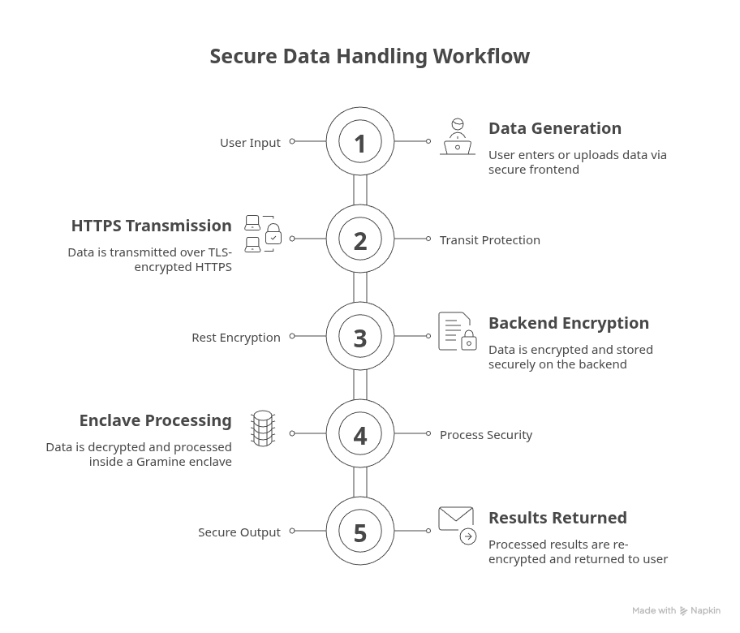
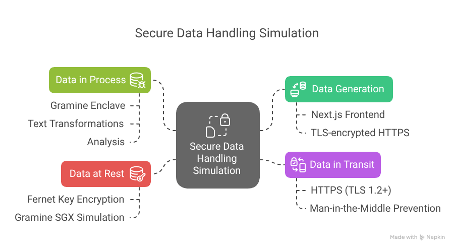
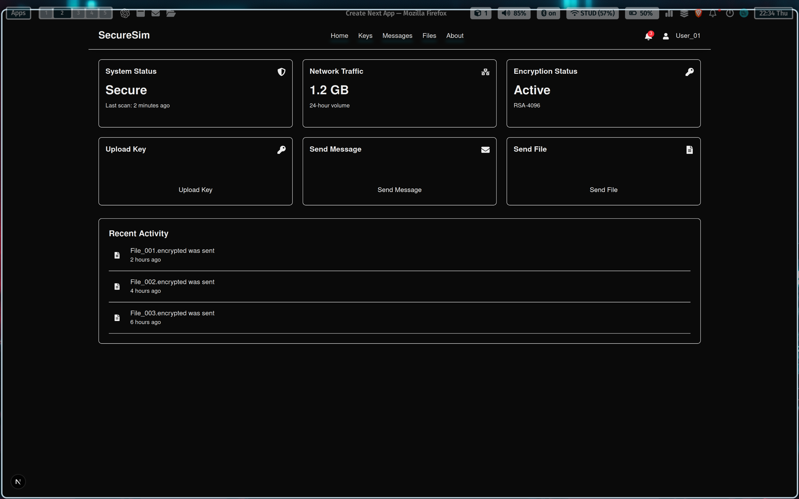
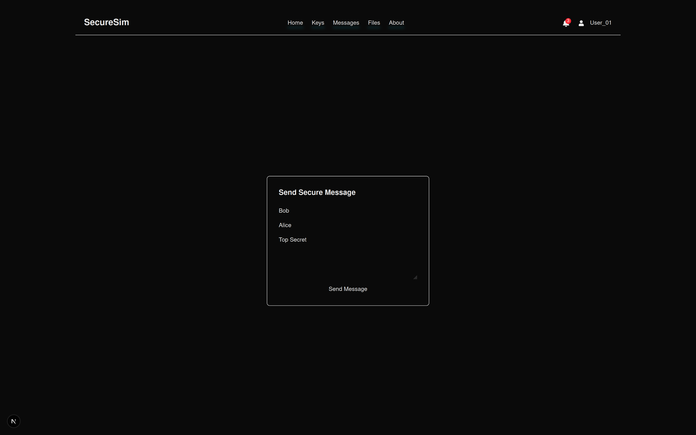

# 🔐 SecureSim — Full-Spectrum Data Security Platform

**SecureSim** is a deployable secure data processing platform that ensures protection of sensitive data **at rest**, **in transit**, and **during computation**. It leverages **Gramine enclaves** (Intel SGX-compatible) to perform cryptographic operations and sealing within a **trusted execution environment** (TEE), offering end-to-end confidentiality and integrity.

Whether you're building a secure messaging system, encrypted storage, or privacy-preserving analytics platform, SecureSim makes it plug-and-play.

---

## 🚀 Features

- 🔐 **Encrypt / Decrypt Endpoints**  
  Secure API endpoints for AES/RSA-based encryption and decryption.

- 💾 **Seal / Unseal Data to Disk**  
  Tamper-proof, SGX-sealed storage using simulated or real Gramine enclaves.

- 🔒 **End-to-End Security**
  - **Data at Rest**: Encrypted and optionally sealed
  - **Data in Transit**: HTTPS/TLS protected
  - **Data in Process**: Enclave-isolated computation

- 🌐 **FastAPI-Powered Backend**
  A clean REST API with encryption and sealing logic baked in.

- 🖥️ **Next.js Frontend**
  Secure web interface for file uploads, message submission, and viewing decrypted content.

- 📊 **Monitoring Endpoints**
  Health checks and optional metrics at `/health`, `/status`, `/metrics`.

---

## 🧱 Architecture Overview




---

## 📂 Directory Structure

```

.
├── data/                         # Sealed storage location
│   └── sealed.txt
├── docker/                      # Dockerfiles for enclave and API
│   └── Dockerfile.enclave
├── gramine/                     # Gramine enclave logic
│   ├── config/
│   │   └── python.manifest.template
│   ├── core/
│   │   ├── encryptor.py
│   │   ├── main.py
│   │   ├── sealer.py
│   │   └── utils.py
│   ├── helper-files/
│   │   └── hosts
│   ├── Makefile
│   └── python.manifest
├── website\_sim/
│   ├── backend/                 # FastAPI backend app
│   └── frontend/                # Next.js frontend app
├── requirements.txt
├── idea.md
└── README.md

````

---

## 📦 Installation

### 🐳 Docker Setup

Build the enclave and backend containers:

```bash
# Build enclave container
docker build -f docker/Dockerfile.enclave -t secure-sim-enclave .
````


The FastAPI API will be available at:
➡️ `http://localhost:8080`

---

## 📡 API Endpoints

### 🔐 `/encrypt` — Encrypt Data

```json
POST /encrypt
{
  "data": "Hello, Secure Sim!"
}
```

**Response**:

```json
{
  "ciphertext": "<encrypted_data>"
}
```

---

### 🔓 `/decrypt` — Decrypt Data

```json
POST /decrypt
{
  "ciphertext": "<encrypted_data>"
}
```

**Response**:

```json
{
  "plaintext": "Hello, Secure Sim!"
}
```

---

### 🛡️ `/seal` — Seal Data to Disk

```json
POST /seal
{
  "data": "Sensitive File Content"
}
```

**Response**:

```json
{
  "status": "Data sealed successfully"
}
```

---

### 📂 `/unseal` — Unseal Sealed Data

```json
POST /unseal
{
  "sealed_data": "<sealed_data>"
}
```

**Response**:

```json
{
  "data": "Sensitive File Content"
}
```

---

### 📈 `/status`, `/metrics`, `/health` — Monitoring

```json
GET /health
{
  "status": "Healthy"
}
```

---

## 🧑‍💻 Development

See individual instructions in:

* [`website_sim/backend/`](website_sim/backend/) — FastAPI backend setup
* [`website_sim/frontend/`](website_sim/frontend/) — Next.js frontend setup

Gramine development (with or without SGX) is handled in `gramine/`.

To enter enclave container interactively:

```bash
docker run -it --rm \
  --security-opt seccomp=unconfined \
  --entrypoint /bin/bash \
  secure-sim-enclave
```

---

## 📸 UI Screenshots

### Dashboard



### Message Sending



---

## 🌍 Future Enhancements

* ✅ Custom encryption algorithm support
* ✅ Real SGX hardware & Remote Attestation (planned)
* 🔐 Role-based access with JWT/OAuth
* 📁 File metadata protection
* 📊 Upload/download progress UI

---

## 📜 License

**MIT** — Use freely. Built for education and secure computing simulation.

---

## 🤝 Acknowledgments

* [Gramine Project](https://gramineproject.io)
* Intel SGX Team
* FastAPI + Next.js communities

---

> Because real security isn't just about locks and keys—it's about not trusting the locksmith.

