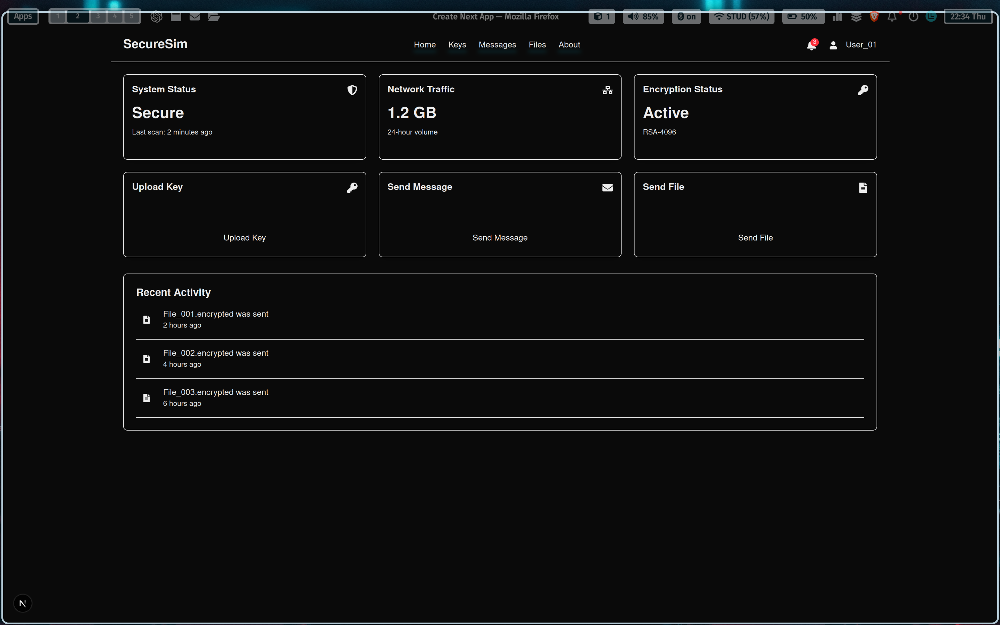
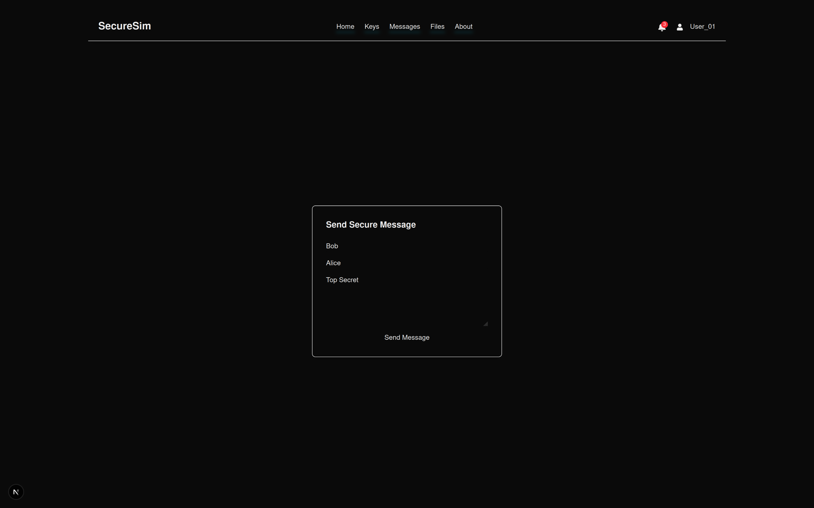

# Frontend

This is the frontend component of the Secure Sim project. It is built using Next.js, React, and Tailwind CSS, providing users with a secure and interactive interface.

## Directory Structure

```
├── eslint.config.mjs
├── next.config.ts
├── package.json
├── postcss.config.mjs
├── public
│   ├── file.svg
│   ├── globe.svg
│   ├── next.svg
│   ├── vercel.svg
│   └── window.svg
├── screenshots
│   ├── dashboard.jpg
│   └── message.jpg
├── src
│   └── app
│       ├── components
│       │   └── navbar.tsx
│       ├── favicon.ico
│       ├── globals.css
│       ├── HomePage.tsx
│       ├── page.tsx
│       ├── send-file
│       │   └── page.tsx
│       ├── send-message
│       │   └── page.tsx
│       ├── upload-key
│       │   └── page.tsx
│       ├── view-files
│       │   └── page.tsx
│       └── view-messages
│           └── page.tsx
└── tsconfig.json
```

### Components

- **src/app/HomePage.tsx**: Main dashboard with user statistics and actions.
- **src/app/components/navbar.tsx**: Navigation bar component shared across all pages.

### Configuration

- **eslint.config.mjs**: ESLint configuration extending Next.js and TypeScript.
- **next.config.ts**: Next.js configuration options.
- **postcss.config.mjs**: Configuration for Tailwind CSS.

## Scripts

Available scripts defined in `package.json`:

- `npm run dev` - Runs the development server.
- `npm run build` - Generates a production build.
- `npm start` - Runs the production build.
- `npm run lint` - Checks the code for linting errors.

## Setup

1. **Install Dependencies**:
   Run the following command to install necessary packages:
   ```
   npm install
   ```

2. **Running the Development Server**:
   Start the frontend server using:
   ```
   npm run dev
   ```

3. **Building for Production**:
   Create a production build with:
   ```
   npm run build
   ```

## UI Screenshots

### Dashboard


### Send Message


## Usage

This frontend component provides a user interface for interacting with the Secure Sim application, allowing operations like sending messages, files, and managing keys.

## Contributing

Contributions are welcome! Please ensure all new code focuses on enhancing the user interface or functionalities provided by the Secure Sim project.

